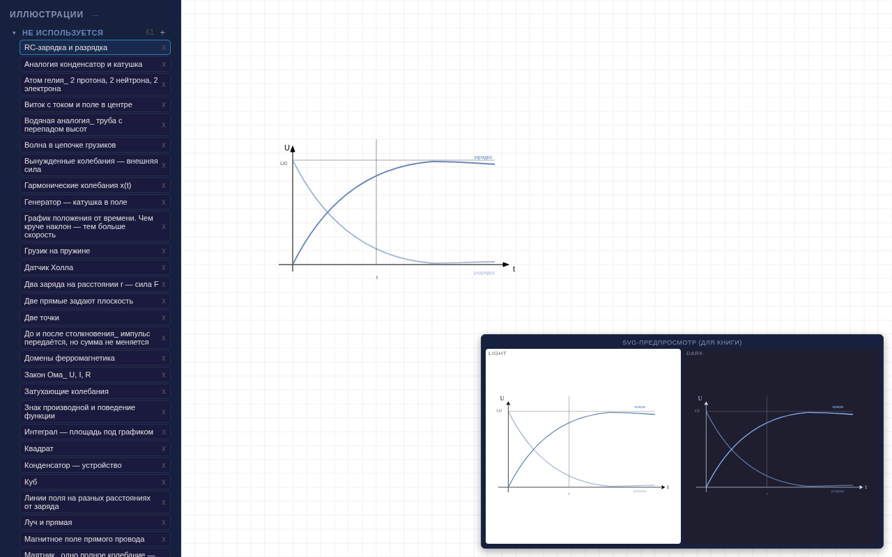

<div align="center">

# Illustration Editor

**SVG illustration editor for an electronics textbook**

[](LICENSE)
[]()
[]()

</div>

A canvas-based vector illustration editor built for the "From Charge to HTML" electronics course. Creates dual-theme SVG illustrations (light/dark) with a science-aware color palette matching the Typst book template. Exports to JSON for version control and batch-generates SVG files.

## ■ Features

- ❖ **Canvas editor** — draw shapes, paths, arrows, and text with react-konva
- ❖ **Dual theme** — every illustration renders in both light and dark mode
- ❖ **Science palette** — color roles mapped to disciplines (math, physics, electronics, CS)
- ❖ **JSON storage** — illustrations saved as JSON, batch-exported to SVG via `generate-svgs.mjs`
- ❖ **Bezier support** — path editing with cubic bezier curves, migration via `fix-beziers.mjs`
- ❖ **Typst integration** — color model synced with the book's `template.typ`

## ■ Stack

| Component | Technology |
|-----------|------------|
| Editor | React 19, react-konva, Konva |
| Build | Vite 8 |
| Export | Node.js scripts (SVG generation) |

## ■ Usage

```bash
npm install
npm run dev       # start editor
node generate-svgs.mjs   # batch-export all SVGs
```

## ■ Screenshots



## ■ License

MIT © [pluttan](https://github.com/pluttan)
